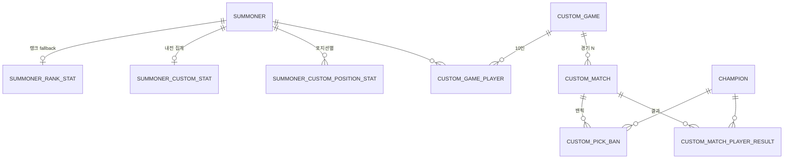

# Oracle DB 스키마

내전 서포트 페이지용 테이블 정의입니다. 실행 파일: [`schema.sql`](./schema.sql)

## 테이블 관계 (요약)



## 전적 표시 정책 (소환사 입력 화면)

| 조건 | 사용 데이터 |
|------|-------------|
| `SUMMONER_CUSTOM_STAT.TOTAL_GAMES = 0` | `SUMMONER_RANK_STAT` (Riot 랭크) |
| `TOTAL_GAMES >= 1` | `SUMMONER_CUSTOM_STAT` (+ 필요 시 `SUMMONER_CUSTOM_POSITION_STAT`) |

경기 결과 저장 시 `CUSTOM_MATCH_PLAYER_RESULT` → 위 집계 테이블 **재계산**.

## 테이블 목록

| 테이블 | 역할 |
|--------|------|
| `CHAMPION` | DDragon 챔피언 캐시 |
| `SUMMONER` | 소환사 마스터 (Riot ID UK) |
| `SUMMONER_RANK_STAT` | 랭크 전적 (큐별, 기본 솔로) |
| `SUMMONER_CUSTOM_STAT` | 내전 전체 집계 |
| `SUMMONER_CUSTOM_POSITION_STAT` | 내전 포지션별 집계 |
| `CUSTOM_GAME` | 내전 세션 (`SESSION_CODE` = 프론트 `sessionId`) |
| `CUSTOM_GAME_PLAYER` | 세션 참가자·팀·포지션·배치 점수 스냅샷 |
| `CUSTOM_MATCH` | 경기 단위 (시리즈 `MATCH_NO`) |
| `CUSTOM_PICK_BAN` | 밴픽 턴 기록 |
| `CUSTOM_MATCH_PLAYER_RESULT` | 경기별 KDA·챔피언·승패 |

## 프론트 ↔ DB 매핑

| 프론트 (Pinia) | DB |
|----------------|-----|
| `sessionId` | `CUSTOM_GAME.SESSION_CODE` |
| `seriesType` single/bo3/bo5/unlimited | `SERIES_TYPE` SINGLE/BO3/BO5/UNLIMITED |
| `peerless` | `PEERLESS_YN` Y/N |
| `currentGame` | `CURRENT_MATCH_NO` |
| `redSeriesWins` / `blueSeriesWins` | `RED_SERIES_WINS` / `BLUE_SERIES_WINS` |
| `Player.gameName` + `tagLine` | `SUMMONER` |
| `Player.puuid` | `SUMMONER.PUUID` |
| `Player` 팀 슬롯 | `CUSTOM_GAME_PLAYER.TEAM_COLOR`, `POSITION_NAME` |
| `suggestedRoute` (이어가기) | `CUSTOM_GAME.STATUS` (아래) |

### 세션 STATUS ↔ 이어가기

| STATUS | 화면 |
|--------|------|
| `PLAYERS` | 팀 배치 |
| `TEAM_SETUP`, `DRAFT` | 밴픽 |
| `RESULT_INPUT` | 경기 결과 |
| `FINISHED`, `CANCELLED` | 복구 불가 |

## 정리 시 반영한 수정 사항

1. **`CUSTOM_GAME` 추가** — 세션 마스터 (기존 DDL 누락)
2. **`SUMMONER_CUSTOM_POSITION_STAT` 중복 제거**
3. **`CHAMPION` FK** — 모스트 챔피언·밴픽·결과에 FK 연결
4. **인덱스** — UK와 중복되는 `IDX_SCS_SUMMONER_ID`, `IDX_SRS_SUMMONER_ID` 제외

## 앱 규칙 (권장)

- Riot ID 저장: `TRIM` + 대소문자 정규화 (UK 충돌 방지)
- `CUSTOM_PICK_BAN`: `ACTION_TYPE='PICK'`이면 `SUMMONER_ID` NOT NULL (서비스 검증)
- `WIN_RATE`, `AVG_KDA` 등: 결과 저장 트랜잭션에서 집계 갱신

## 실행

1. **SYS AS SYSDBA** 로 `create-user-lol-scrim.sql` 수정·실행 (계정 없을 때, `ORA-01918`)  
2. **SYS** 로 `grant-tablespace-quota.sql` 실행 — `USERS` 쿼터 (`ORA-01950`)  
3. **`c##lol_scrim`** 으로 `schema.sql` 실행

```sql
-- 1) SYS — 계정 생성 (비밀번호는 application-oracle-local.yml 과 맞출 것)
@database/create-user-lol-scrim.sql

-- 2) SYS — 쿼터 (계정 생성 시 QUOTA 를 이미 줬으면 생략 가능)
@database/grant-tablespace-quota.sql

-- 3) c##lol_scrim
@database/schema.sql
```

**SYS에서 계정 존재 확인:**

```sql
SELECT username, account_status, common
FROM dba_users
WHERE username LIKE '%SCRIM%';
```

### ORA-01950 (다음 → DB 저장 시)

`no privileges on tablespace 'USERS'` — 계정에 **테이블스페이스 쿼터**가 없을 때 `INSERT` 가 실패합니다.  
(12c 이후 `RESOURCE` 역할만으로는 쿼터가 자동으로 안 붙는 경우가 많습니다.)

→ 위 1번 `grant-tablespace-quota.sql` 을 SYS 로 실행한 뒤, Players 화면에서 다시 **다음** 을 누르세요.

Spring Boot JPA Entity·Repository: `backend/src/main/java/com/civilwar/domain/`  

**로컬 Oracle (XE)**  
- JDBC: `jdbc:oracle:thin:@localhost:1521:xe`  
- 사용자: `c##lol_scrim`  
- 백엔드 실행: 프로젝트 루트 `npm run server` (Oracle 기본)
